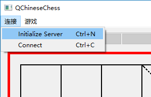
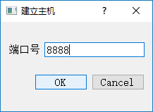
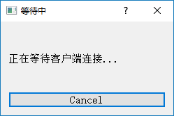
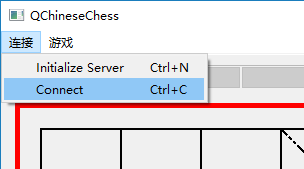
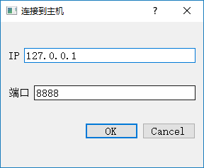
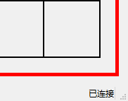
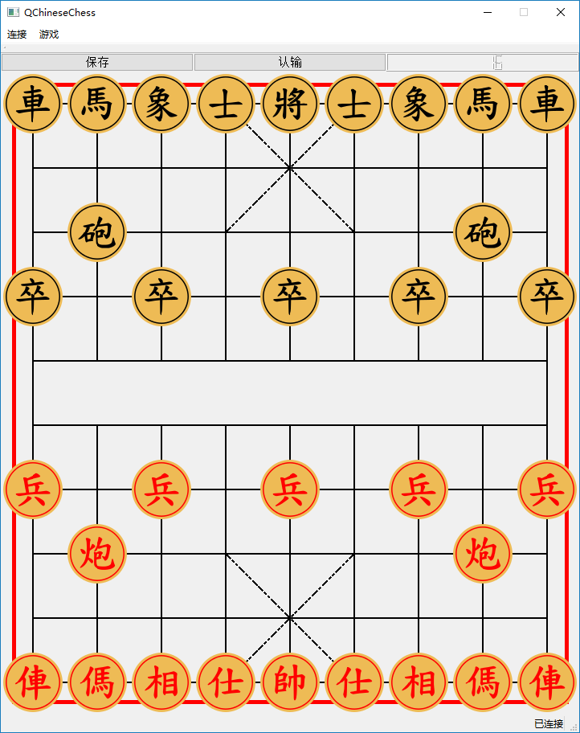

# QChinessChess 的功能、设计和实现

于是 2017011414

## 客户端、服务器端工作流程

QChinessChess 应用程序是客户端、服务器端合一的。

选择「连接->Initialize Server」，建立主机。在弹出的窗口中输入端口号。

点击「OK」，建立主机，弹出等待窗口。这时候已经建立了 TCP 服务器，开始监听了（可取消）：

在客户端，启动相同的应用程序。选择「连接->Connect」，连接到主机：

点击「OK」后，若连接成功，服务器端状态栏会显示「已连接」：

这时候连接便完成了。在任意端，选择「游戏->New Game」，可开始新游戏：

或是选择「游戏->Load from file」，选择残局进行加载。无论是新游戏还是加载残局，都默认开局的一方是红方（即：若是新游戏，则一定是开局者先走；若是从残局加载，则开局者执红，谁先走视残局文件而定）。

在游戏进行的过程中，任何一方都可以在自己走子/对方走字的时候选择认输/保存残局。保存残局不会影响游戏进程。

每步走子时，自己判断自己走子的合法性。接收时，根据收到的信息移动对方棋子，不对对方走子合法性进行检查。

## 通信协议

下列几种情形需要通过网络传递信息：

- 一方发起新游戏
- 一方加载残局
- 一方时间用尽
- 一方认输
- 一方走子

动作的发起端传递相应的信息，接收端根据收到的信息进行响应。具体协议如下：

| `msg.at(0)`    | 行为                                                     | 后续字节及其解释                                             |
| -------------- | -------------------------------------------------------- | ------------------------------------------------------------ |
| `'n'`          | 新棋局                                                   | 无                                                           |
| `'b'` 或 `'r'` | 开始残局                                                 | 完整的残局信息，格式与残局文件相同。一方加载残局文件时，先在本地绘制残局，再将未处理的残局文件发给对方。对方按照同样的规则解析残局文件并绘制残局。本地和对方分别根据残局文件判断自己为先手还是后手，前提是加载残局的一方永远是红方。 |
| `'W'`          | 发出「您赢了！」的信息（可能是因为对方时间不足或者认输） | 无                                                           |
| 棋子字符       | 显示对方的棋子的移动，得知自己被将军或负                 | 第二个字节是棋子原来的位置，第三个字节是棋子移动后的位置。位置是依据发送者左上角为 0 确定的，接收者需要用 89 减之。第四个字符若是`'j'`，则表示自己被将军了，播放将军音效。第四个字符若是`'w'`，则表示自己将被吃了，自己负，弹出「您输了」的提示。其他情况下，第四个字符安排为字符串结束符 `'\0'`。 |

「棋子字符」规定如下：

| 棋子字符                                            | 棋子 `Utili::chess_type` |
| --------------------------------------------------- | ----------------------------- |
| `'j'`                                               | 车 `Utili::JU`                |
| `'m'`                                               | 马 `Utili::MA`                |
| `'x'`                                               | 象/相 `Utili::XIANG`          |
| `'s'`                                               | 士/仕 `Utili::SHI`            |
| `'w'`                                               | 将/帅 `Utili::JIANGSHUAI`     |
| `'B'` 注：此处大写，是为了和残局首字符作区别。 | 卒/兵 `Utili::ZUBING`         |
| `'p'`                                               | 砲/炮 `Utili::PAO`            |

其中，`Utili::chess_type` 是 `Utili.h` 中定义的枚举类型。`Utili.h` 中还定义了其他枚举类型、常用的函数以及必要的宏，提升了代码的可读性、复用性、灵活性。

## 网络通信编程框架

使用了 Qt5Network 库。使用 `QTcpServer` 建立服务器，使用 `QTcpSocket` 作为 socket。

使用 `QTcpServer::listen` 进行监听。连接 `newConnection()` 信号。使用 `QTcpServer::nextPendingConnection` 得到 `QTcpSocket`。使用 `QTcpSocket::write` 发送信息。使用 `QTcpSocket::readAll` 先读取所有信息，再进行解析。